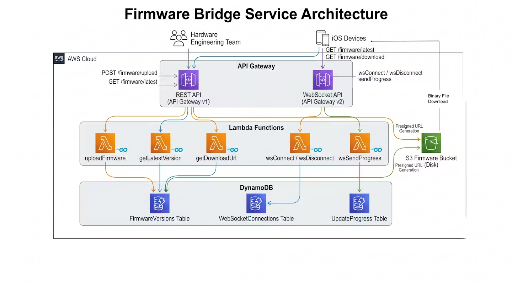

# Firmware Bridge Service Architecture

This service acts as a bridge between the hardware engineering team and iOS devices, enabling seamless firmware updates.

## Core Components

### 1. API Layers
- **REST API (API Gateway v1):** Used for standard request/response operations like uploading new firmware binaries, fetching the latest version, and getting secure download URLs.
- **WebSocket API (API Gateway v2):** Ingests real-time update progress from devices. *(Note: Broadcasting these updates to listening clients is not yet implemented).*

### 2. Compute (Lambda Functions - Go / ARM64)
All compute logic is handled by serverless AWS Lambda functions written in Go. They are compiled for ARM64 to optimize cost and performance.
- `uploadFirmware`: Generates presigned S3 URLs for the hardware team to upload binaries and records the version info.
- `getLatestVersion`: Queries the newest firmware version.
- `getDownloadUrl`: Generates a short-lived, secure presigned S3 GET URL so the iOS app can download the firmware.
- `wsConnect` / `wsDisconnect`: Manages the lifecycle of WebSocket connections.
- `wsSendProgress`: Receives update progress events from devices and stores them for monitoring.

### 3. Storage
- **Amazon S3 (`FirmwareBucket`):** Securely stores the physical firmware binaries (`.bin` files). Access is restricted and temporary URLs are used for uploads and downloads.
- **Amazon DynamoDB:**
  - `FirmwareVersions`: Stores metadata about each firmware release.
  - `WebSocketConnections`: Tracks active client WebSocket connections.
  - `UpdateProgress`: Stores the latest update status and percentage for each individual device.

## Workflows

### Upload Flow (Hardware Team)
1. Hardware team makes a `POST /firmware/upload` request.
2. Lambda writes version metadata to `FirmwareVersions` and returns a presigned S3 PUT URL.
3. Hardware team uploads the binary directly to the S3 Bucket using the presigned URL.

### Download Flow (iOS App)
1. iOS App calls `GET /firmware/latest` to check if an update is needed.
2. If needed, calls `GET /firmware/download` to receive a presigned S3 GET URL.
3. Downloads the firmware directly from S3 and transfers it to the hardware via BLE.

### Progress Monitoring
1. Client connects via `wss://...` -> `wsConnect` saves connection.
2. During the BLE update, device/app sends `sendProgress` messages.
3. `wsSendProgress` updates the `UpdateProgress` table in DynamoDB. The Firmware team currently monitors which devices are updating by querying the DynamoDB table directly. *(Note: Real-time broadcasting of these updates to connected clients has not yet been implemented).* 